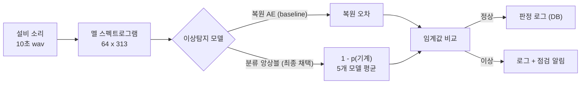
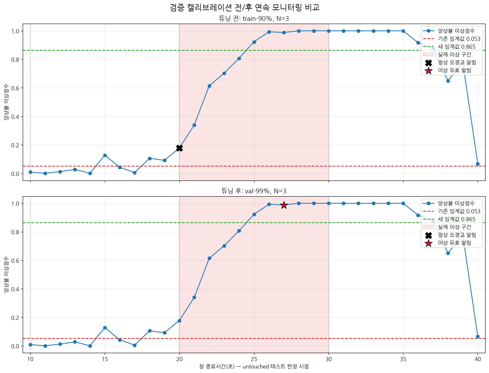

# 소리 기반 설비 이상 감지 (Sound-based Equipment Anomaly Detection)

공장 설비의 **소리**를 듣고 고장 징후(이상)를 감지하는 딥러닝 예지보전 프로젝트.
자동차 부품사 프레스 설비 적용을 목표 시나리오로, **정상 소리만으로 학습하는 이상탐지**를 다룬다.

- **입력** 설비 가동 소리(wav) → **처리** 멜 스펙트로그램 → 딥러닝 모델 → **출력** 정상 / 이상
- **핵심 제약** 실제 공장엔 고장 데이터가 거의 없다 → 정상만 학습하고 "정상과 다르면 이상"으로 판정
- **한 줄 요약** 복원 AutoEncoder로 시작해 한계를 만나고, 분류 기반으로 돌파하고, 불안정의 원인을 추적해 앙상블로 해결한 **정직한 문제해결 과정**

---

## 시스템 흐름



---

## 개발 여정

이 프로젝트의 핵심은 최고 점수가 아니라, **가설을 세우고 데이터로 검증·반증하며 진짜 원인을 추적한 과정**이다.

| 단계 | 한 일 | 결과 |
|------|------|------|
| ① 복원 AE | 정상만 학습, 복원 오차로 판정 | id_00 AUC **0.95**, 소음 −6dB에서도 0.96 |
| ② 한계 발견 | 기계 4대로 일반화 검증 | id_04 0.53 / id_06 0.48 — **일반화 실패** |
| ③ 분류 전환 | "복원" 대신 "기계 ID 구별"(DCASE 계열) | 못 잡던 **id_04를 0.53 → 0.99로** 돌파 |
| ④ 불안정 추적 | 일부 기계가 실행마다 널뛰는 현상 | 가설 → **반증** → 재추적 → 원인 = "모델 초기값 운" 확정 |
| ⑤ 앙상블 해결 | 초기값 다른 모델 5개 판단을 평균 | 급락 0.70 → **0.98**로 안정화 |
| ⑥ 연속 감시 | 슬라이딩 윈도우 + 임계값 재보정 | 임계값만으론 오탐↔미탐 못 푼다는 **정직한 한계**까지 규명 |

---

## 주요 결과

**분류 전환으로 어려운 기계를 돌파** — 복원이 못 살리던 id_04를 0.53 → 0.99로 개선


**앙상블로 불안정 해결** — 초기값 운으로 널뛰던 성능(단일 최저 0.70)을 앙상블이 안정화(3-split 편차 ≤ 0.006)


**연속 감시의 정직한 한계** — 오탐을 줄이려 임계값을 올리면 탐지율이 떨어지는 trade-off (오탐 33.6%→0.93%, 탐지 100%→72.5%). "임계값만으로는 안 되며 실데이터 검증이 필요하다"는 결론



**그 밖에**
- **소음 강건성** 6dB 0.998 / 0dB 0.988 / −6dB 0.961 — 소음이 세져도 완만한 하락
- **구현 검증** −6dB 결과가 MIMII 공식 논문 베이스라인과 일치(id_00 0.94≈0.93, id_02 0.73≈0.74, id_06 0.48≈0.52)
- **데이터 누수 없음** 정규화 기준을 학습 데이터에서만 계산, 다중 seed로 재현성 확인, 임계값·규칙은 검증셋에서만 튜닝

---

## 데이터셋: MIMII (slider)

히타치가 공개한 산업기계 소리 데이터셋. slider(왕복 운동 기계 → 프레스와 유사)의 정상/이상 소리를
실제 공장 배경소음과 3가지 강도(6dB / 0dB / −6dB SNR)로 섞어 제공한다.

- 다운로드: https://zenodo.org/records/3384388 (경량 버전: https://zenodo.org/records/3678171)
- 사용한 소음 레벨은 **−6dB(가장 시끄러운 조건)** — 파일 해시로 확인해 라벨을 바로잡은 뒤 진행

| 기계 | normal | abnormal |
|------|-------:|---------:|
| id_00 | 1068 | 356 |
| id_02 | 1068 | 267 |
| id_04 | 534 | 178 |
| id_06 | 534 | 89 |

---

## 기술 스택

`Python 3.11` · `PyTorch (CUDA)` · `librosa` · `scikit-learn` · `MySQL (PyMySQL)` · `Streamlit` · `pytest`

---

## 프로젝트 구조

```
sound_anomaly_project/
├── notebooks/   # 실험 노트북 (탐색 → 전처리 → 학습 → 평가 → 분류 → 앙상블 → 연속감시)
├── src/         # 재사용 파이프라인 패키지 (config/data/preprocess/dataset/model/train/evaluate)
├── assets/      # 결과 그래프
├── tests/       # pytest 유닛 테스트 (실제 데이터 없이 실행 가능)
├── app.py       # Streamlit 데모
└── requirements.txt
```

> `data/`, `models/`(학습된 가중치), MySQL 접속 정보는 **용량·보안상 저장소에 포함하지 않는다.**
> 데이터는 위 링크에서 받아 전처리하고, 모델은 노트북으로 재생성한다(아래).

---

## 노트북 (파이프라인 순서)

| 노트북 | 내용 |
|--------|------|
| `00_practice_synthetic` | 가짜 소리로 파형/스펙트로그램 개념 연습 (데이터 불필요) |
| `01_data_exploration` | MIMII 데이터 탐색 |
| `02_preprocessing` | wav → 멜 스펙트로그램 변환·저장 |
| `03_autoencoder` | AutoEncoder를 정상 소리만으로 학습 |
| `04_evaluation` | 복원 오차로 AUC 계산 + 판정 임계값 설정 |
| `05_noise_experiment` | 소음 3레벨(6/0/−6dB) AUC 비교 |
| `06_judgment_log_db` | 판정 로그 MySQL 저장/조회 |
| `07_robustness` · `08_generalization` | 다중 seed 재현성 · 다른 기계 일반화(복원 한계 발견) |
| `09_cnn_autoencoder` · `10_cnnbn_robustness` | CNN AutoEncoder 비교(병목의 중요성) |
| `12_classification` | 기계 ID 분류 기반 이상탐지 + 다중 seed |
| `14_confusion_diagnosis` | 불안정 원인 진단(혼동행렬 + 정상/이상 확률 분포) |
| `15_ensemble` · `16_save_ensemble` | 다중 초기값 앙상블 검증 · 배포용 모델 저장 |
| `17_sliding_window` · `18_monitoring_calibration` | 연속 감시(슬라이딩 윈도우) · 임계값 재보정 |

---

## 실행 방법

```bash
# 1. 환경
pip install -r requirements.txt

# 2. 테스트 (실제 데이터 없이 동작 — 파이프라인 검증)
pytest -q

# 3. 데이터 준비 → 학습
#    MIMII slider를 data/ 에 받은 뒤, 노트북 02 → 03 → (12 → 16) 순서로 실행해
#    전처리 결과와 모델(models/)을 생성한다.

# 4. 데모 (models/ 생성 후)
streamlit run app.py
```

데모: 설비 선택 → 10초 wav 업로드 → **분류 앙상블**로 정상/이상 판정 + 스펙트로그램 + 판정 로그(MySQL) 기록.

---

## 정직한 한계 & 향후 계획

- **한계** — MIMII는 벤치마크(실제 프레스 아님) / id_06처럼 미묘한 고장은 여전히 어려움 / 연속 감시 임계값은 데이터가 부족해 재검증 필요
- **향후** — 직접 녹음한 실데이터 미니 PoC(수집→재학습→실시간 감시) · 실시간 모니터링 대시보드 · 소리 + 진동 센서 보완 · 배포 후 재학습 체계
