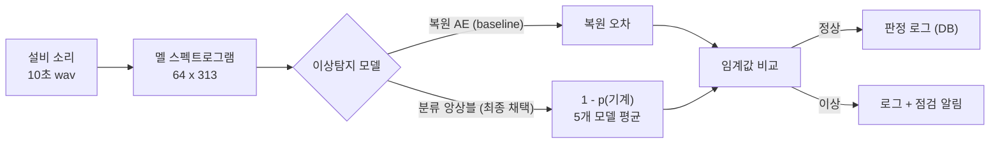
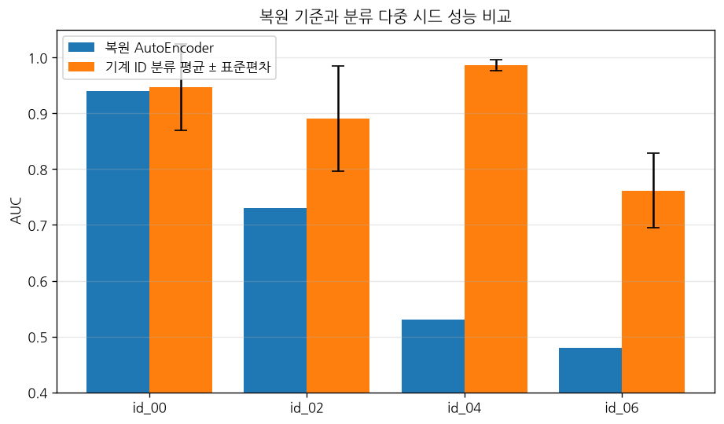
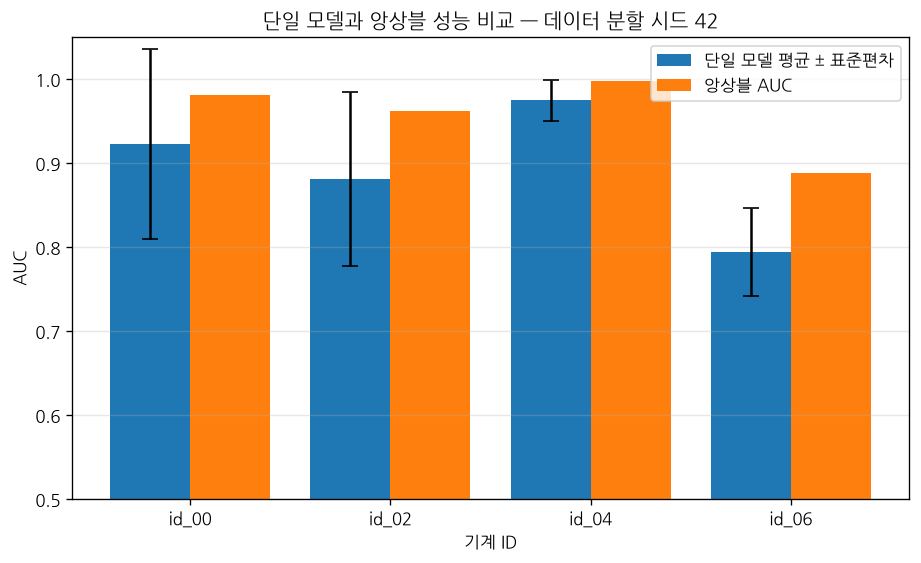
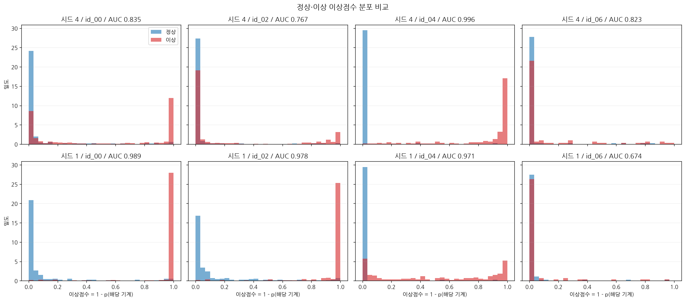

# 소리 기반 설비 이상 감지 프로젝트

프레스 공장 설비의 소리를 듣고 이상(고장 징후)을 감지하는 딥러닝 프로젝트.
자동차 부품사(아진산업)의 프레스 설비 예지보전에 적용하는 것을 목표 시나리오로 한다.

## 프로젝트 개요

- **입력**: 설비 가동 소리 (wav 파일)
- **처리**: 소리 → 스펙트로그램(이미지) 변환 → 딥러닝 모델
- **출력**: 정상 / 이상 판정
- **핵심 아이디어**: 고장 데이터가 거의 없는 실제 공장 상황을 고려해, **정상 소리만으로 학습**
  (복원 AutoEncoder로 시작 → 기계 ID 분류 → 다중 초기값 앙상블로 발전, 최종 최고 성능은 분류 앙상블)

## 시스템 흐름



## 데이터셋: MIMII

히타치가 공개한 산업기계 소리 데이터셋. 4종류 기계(fan, pump, slider, valve)의
정상/이상 소리를 실제 공장 배경소음과 3가지 강도(6dB, 0dB, -6dB SNR)로 섞어 제공.

- 다운로드: https://zenodo.org/records/3384388
- 참고(더 가벼운 버전): DCASE 2020 Task 2 개발용 데이터 https://zenodo.org/records/3678171

**slider(슬라이더)** 사용 (왕복 운동 기계라 프레스와 유사한 스토리).
소음 3레벨(6dB/0dB/-6dB)을 모두 받아 성능 비교까지 완료 (5단계).

> ⚠️ **라벨 정정 (2026-07-08)**: 초기에 "6dB로 시작"이라 적었으나 실제 받아둔 데이터는
> **-6dB(가장 시끄러운 버전)**였음이 파일 해시 대조로 확인됨. 그래서 `data/slider/`(=-6dB) 기준으로
> 1~4단계를 진행했고, 이후 6dB(`data/slider_6dB/`)·0dB(`data/slider_0dB/`)를 추가로 받아 비교했다.

## 데이터 준비 상태 (2026-07-07 압축해제, 2026-07-08 -6dB로 정정)

`data/slider/` 에 **-6dB** 데이터 압축 해제 완료. 기계 4대(id_00, 02, 04, 06), wav 파일 개수:

| 기계 | normal | abnormal |
|------|--------|----------|
| id_00 | 1068 | 356 |
| id_02 | 1068 | 267 |
| id_04 | 534 | 178 |
| id_06 | 534 | 89 |

## 진행 계획

1. [x] 데이터 다운로드 및 소리 데이터 탐색 (파형, 스펙트로그램 그려보기) — 2026-07-07 완료
2. [x] 전처리: 소리 → 멜 스펙트로그램 변환 — 2026-07-07 완료, `data/processed/slider/`에 npy 8개
3. [x] AutoEncoder 모델 학습 (정상 소리만 사용) — 2026-07-08 완료, 이상 복원 오차가 정상의 1.7배로 분리 확인
4. [x] 평가: 이상 소리를 얼마나 잘 잡아내는지 (AUC, 임계값 설정) — 2026-07-08 완료, **-6dB 데이터에서** AUC 0.95 (90퍼센타일 임계값 채택 시 미탐 8/356)
5. [x] 소음 강도별 성능 비교 — 2026-07-09 완료. AUC 6dB 0.998 / 0dB 0.988 / -6dB 0.961 (소음↑ 완만히↓, 최악 조건도 0.96 유지)
6. [x] 정리: 실제 공장 도입 시나리오 + 판정로그 DB(MySQL) + Streamlit 데모 — 2026-07-09 완료

**➡ 진행 계획 1~6단계 전부 완료 (2026-07-09).**

### 심화 (완성도 향상 + 성능 돌파, 2026-07-10~12)

7. [x] Tier1 리팩토링(git·requirements·`src/` 모듈화) + 다중 seed 재현성(AUC 0.966 ± 0.011) — `07`
8. [x] 다른 기계 일반화 검증 → **복원 AE의 한계 발견**(id_04 0.53 / id_06 0.48) — `08`
9. [x] CNN AutoEncoder 실험(병목 유무 비교, "강한 복원 ≠ 좋은 이상탐지" 확인) — `09`, `10`
10. [x] **분류 기반(기계 ID)으로 전환 → id_04 0.53→0.99 돌파** (DCASE SOTA 재현) — `12`
11. [x] 다중 seed로 id_00/02 불안정 발견 → 원인 추적(가설→반증→재추적→확정 = "모델 초기값 복불복") — `14`
12. [x] **다중 초기값 앙상블로 안정화**(급락 0.70→0.98) + 데모 앱을 앙상블로 업그레이드 — `15`, `16`

한눈에 보는 여정: **복원 AE(한계) → 분류(돌파) → 불안정 발견 → 원인 추적 → 앙상블(해결) → 데모 탑재.**
이후 확장 계획은 `docs/확장_로드맵.md` 참고.

## 결과 요약

- **이상 탐지 성능**: AUC **0.95** (-6dB, id_00 기준) / 여러 seed 반복 시 **0.966 ± 0.011**
- **일반화 (정직한 한계)**: 복원 AE는 id_00 0.94 / id_02 0.73 / id_04 0.53 / id_06 0.48 — id_00에만 잘 되고 일반화 미흡
- **분류 기반으로 돌파 (DCASE SOTA 재현)**: 기계 ID 분류(정상만 학습)로 다중 seed 평균 id_00 0.95 / id_02 0.89 / **id_04 0.99** / id_06 0.76 — 복원이 못 살리던 **id_04를 0.53→0.99로** 개선
- **불안정 추적 → 앙상블로 해결**: id_00/02가 seed마다 불안정 → "유사 기계 정상 혼동" 가설을 혼동행렬로 **반증** → 진짜 원인은 "이상 소리를 정상으로 착각"(근본 = 모델 초기값 복불복) → **다중 초기값 앙상블**로 급락(0.70)을 id_00 0.99 / id_02 0.97로 안정화(3-split 편차 ≤0.006). id_06만 데이터 한계로 잔존(0.85)
- **소음 강건성**: 6dB **0.998** / 0dB **0.988** / -6dB **0.961** — 소음↑에도 완만한 하락(급락 아님)
- **판정 임계값**: 학습 정상 오차 90퍼센타일 채택 → 이상 356건 중 미탐 8건 (미탐 최소화 우선)
- **검증**: 단순 기준선(스펙트로그램 평균)도 AUC 0.88 → id_00은 비교적 쉬운 케이스이나, AE가 0.95로 개선. 데이터 누수 없음 확인
- **데모**: 설비 선택 → wav 업로드 → **분류 앙상블(최고 방법)로 판정** → 판정 이력 MySQL 기록까지 동작 확인 (실제 wav 4/4 정확). 초기 복원 AE 데모도 baseline으로 보존

## 대표 결과 그래프

**복원 vs 분류 (다중 seed 평균 ± 편차)** — 어려운 기계 id_04/06에서 분류가 크게 앞선다


**단일 모델 vs 앙상블** — 초기값에 따라 널뛰던 단일 모델을 앙상블이 안정화한다


**정상 vs 이상 이상점수 분포** — 잘 되는 경우 두 분포가 벌어지고, 불안정할 때는 겹친다


## 폴더 구조

```
sound_anomaly_project/
├── data/          # MIMII 데이터 (-6dB=slider, slider_6dB, slider_0dB; git 제외)
├── notebooks/     # 실험 노트북 + 단계별 설계 문서(XX_설계.md)
├── models/        # 복원 baseline(ae_id00_v1.pth 등) + 분류 앙상블(idclf_0~4.pth, clf_minmax/clf_thresholds.npy)
├── assets/        # README용 대표 그래프 PNG
├── app.py         # Streamlit 데모 (streamlit run app.py)
├── db_config.py   # MySQL 접속 설정 (비밀번호 포함 → git 제외)
└── README.md
```

## 개발 환경 (2026-07-06 설정 완료)

- conda 환경 **DL_PY311** 사용 (`C:\Users\KDT024\miniconda3\envs\DL_PY311`)
- Python 3.11 / torch 2.11 (CUDA, GPU 사용 가능) / librosa 0.11 설치됨
- 노트북 실행 시 커널을 DL_PY311로 선택할 것

## 노트북 목록

- `00_practice_synthetic.ipynb` : 가짜 기계 소리를 만들어 파형/스펙트로그램 개념 연습 (데이터 불필요)
- `01_data_exploration.ipynb` : MIMII 실제 데이터 탐색 (데이터 다운로드 필요)
- `02_preprocessing.ipynb` : 전체 wav → 멜 스펙트로그램 변환, `data/processed/slider/`에 `기계_라벨.npy` 8개 저장
- `03_autoencoder.ipynb` : AutoEncoder를 정상 소리만으로 학습, `models/ae_id00_v1.pth` 저장 (설계: `03_autoencoder_설계.md`)
- `04_evaluation.ipynb` : 테스트 전체 복원 오차로 AUC(0.95) 계산 + 판정 임계값 설정 (설계: `04_evaluation_설계.md`)
- `05_noise_experiment.ipynb` : 소음 3레벨(6/0/-6dB) AUC 비교 (설계: `05_noise_experiment_설계.md`)
- `06_judgment_log_db.ipynb` : 판정 로그 MySQL DB 저장/조회 (설계: `06_deployment_scenario_설계.md`)

**심화 노트북:**

- `07_robustness.ipynb` : 다중 seed 재현성 (AUC 평균 ± 편차)
- `08_generalization.ipynb` : 다른 기계(id_02/04/06) 일반화 검증 — 복원 AE의 한계 발견
- `09_cnn_autoencoder.ipynb` : Linear vs CNN vs CNN-병목 AutoEncoder 비교
- `10_cnnbn_robustness.ipynb` : CNN-병목 다중 seed 재현성
- `12_classification.ipynb` : 기계 ID 분류 기반 이상탐지 + 다중 seed (설계: `11_classification_설계.md`)
- `14_confusion_diagnosis.ipynb` : 불안정 원인 진단 (혼동행렬 + 정상/이상 확률 분포)
- `15_ensemble.ipynb` : 다중 초기값 앙상블 검증 (고정 split, 초기값 vs 분할 원인 분리)
- `16_save_ensemble.ipynb` : 배포용 앙상블 모델 5개 + 정규화/임계값 저장 (설계: `16_ensemble_deploy_설계.md`)

## 데모 실행법

```
conda activate DL_PY311        # 또는 아래처럼 전체 경로로
cd c:\Users\KDT024\Desktop\sound_anomaly_project
streamlit run app.py
```
브라우저에서 설비(id_00/02/04/06) 선택 → 10초짜리 wav 업로드 → 분류 앙상블 판정(정상/이상) + 스펙트로그램 + DB 기록.
(가상환경이 안 잡히면: `C:\Users\KDT024\miniconda3\envs\DL_PY311\python.exe -m streamlit run app.py`)
